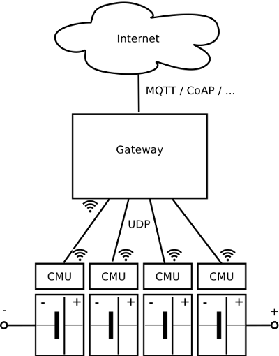

# Arduino-based Smart Battery Cell Research Platform

Accessible smart battery cell research platform based on the Arduino environment. Smart battery cells are a recent research direction in the scope of Battery Management Systems (BMS) for large lithium-ion battery packs, where each battery cell is equipped with an individual Cell Management Unit (CMU). The wireless System on Chip (SOC) solution ESP8266 forms the core of the research platform. It is deployed on an off-the-shelf development board and extended with a custom shield. A single-board computer provides the wireless network for the smart battery cells and acts as gateway to a web service for interaction purposes. As a proof-of-concept, a web client is created that communicates with the battery pack via the MQTT protocol.

## Repository Structure

### cloud
Cloud server running MQTT broker and Webserver. See [setup guide](cloud/README.md) for more details.

### cmu
Cell Management Unit Arduino sketch.

### doc
Documentation comprising a [PDF paper](doc/paper.pdf) and a more detailed [PDF report](doc/report.pdf).

### gateway
Gateway Java code. Also contains a [setup guide](gateway/README.md) for a Raspberry Pi 3.

### schematic
Schematic design files (CadSoft EAGLE) of the smart battery cell.
